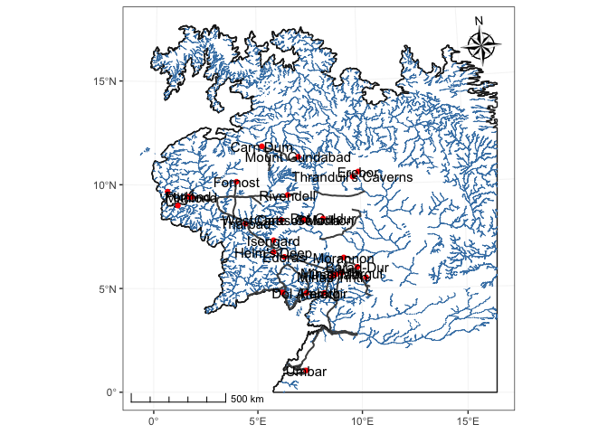
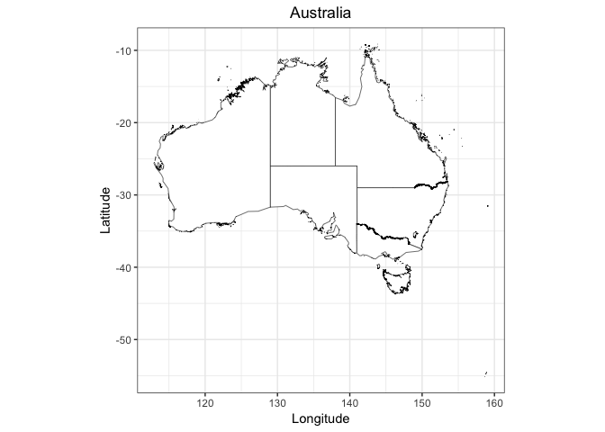
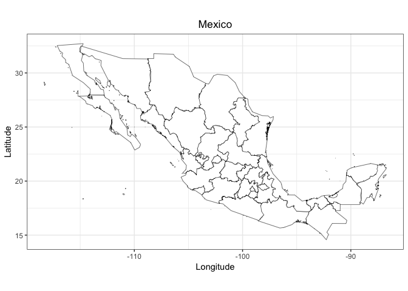

## Link
[https://github.com/xiyuansun/stat585-lab2](https://github.com/xiyuansun/stat585-lab2)

## Team Members
- Steven Harms
- Yang Qiao
- Xiyuan Sun
- Jing Zhao


## More map elements

```r
library(tidyverse)
library(sf)
library(ggspatial)

p <- ggplot(data = read_sf("data/ME-GIS/Cities.shp")) +
  geom_sf(data = read_sf("data/ME-GIS/Coastline2.shp"),
          colour = "grey10", fill = "grey90") +
  geom_sf(data = read_sf("data/ME-GIS/Rivers19.shp"),
          colour = "steelblue", size = 0.3) +
  geom_sf(data = read_sf("data/ME-GIS/PrimaryRoads.shp"),
          size = 0.7, colour = "grey30") +
  geom_sf(color = "red") +
  geom_sf_text(aes(label = Name), size = 4, color = "black", position = "jitter") +  # add labels
  annotation_scale(style = "ticks") +  # add scale
  annotation_north_arrow(which_north = "true", location = "tr", style = north_arrow_nautical()) +  # add North
  labs(x = NULL, y = NULL) +
  theme_bw()
p
```



## Australia shapefile

```r
# apply to each state/row of geometry field in the sf dataset
poly2df <- function(feature, unlist = T) {
  if (unlist) feature <- unlist(feature, recursive = F)
  lapply(feature, function(x) {
    mutate(rename_all(data.frame(x), ~ c("long", "lat")), order = row_number())
  }) %>% tibble(polygon = .)
}

# create new dataset reforming geometry to long, lat, order, group
makedata <- function(data, thin = T, unlist = T) {
  if (thin) {
    oz_st <- maptools::thinnedSpatialPoly(as(data, "Spatial"), tol = 0.1, min = 0.001, topologyPreserve = T)
    oz <- st_as_sf(oz_st)  # install package: rgeos
  } else oz <- data
  
  as_tibble(oz) %>% mutate(new = map(geometry, poly2df, unlist = unlist)) %>% select(-geometry) %>%
    unnest() %>% mutate(group = row_number()) %>% unnest()
}


australia <- read_sf("data/gadm36_AUS_shp/gadm36_AUS_1.shp")
australia_plus <- makedata(australia)
australia_plus %>%
  ggplot(aes(x = long, y = lat, group = group)) +
  geom_polygon(color = "black", fill = "white", size = 0.2) +
  labs(x = "Longitude", y = "Latitude", title = "Australia") +
  coord_fixed() +
  theme_bw() +
  theme(plot.title = element_text(hjust = 0.5))
```



## Mexico shapefile

```r
mexico <- read_sf("data/gadm36_MEX_shp/gadm36_MEX_1.shp")
mexico_plus <- makedata(mexico)
mexico_plus %>%
  ggplot(aes(x = long, y = lat, group = group)) +
  geom_polygon(color = "black", fill = "white", size = 0.2) +
  labs(x = "Longitude", y = "Latitude", title = "Mexico") +
  coord_fixed() +
  theme_bw() +
  theme(plot.title = element_text(hjust = 0.5))
```


